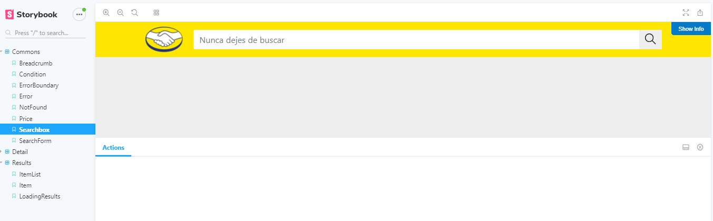
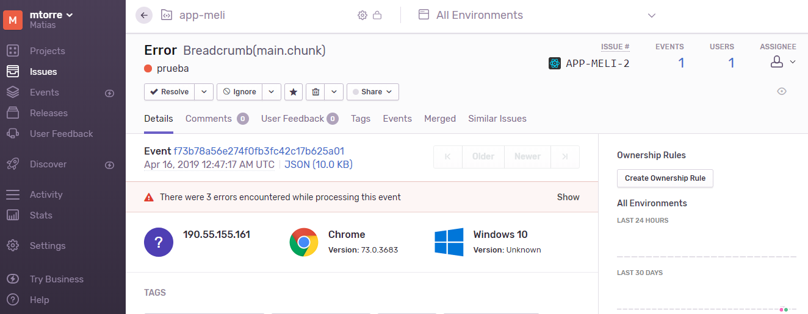

# frontend-meli

Frontend de la aplicación interview de mercadolibre.

[](https://travis-ci.com/mtorre4580/front-meli)
[](https://conventionalcommits.org)
[](https://storybook.js.org)

## Overview

La aplicación fue desarrollada con [React](https://reactjs.org/).
Se utilizó [Redux](https://redux.js.org/) para manejar el state de la aplicación , [Redux Saga](https://redux-saga.js.org/) para los side effect, se aplicó 
[Redux Form](https://redux-form.com/) para manejar el state del formulario de búsqueda, [Axios](https://github.com/axios/axios) como client para las peticiones HTTP, 
[Boostrap](https://getbootstrap.com/) para los estilos, [SASS](https://sass-lang.com/) como preprocesador, [Recompose](https://github.com/acdlite/recompose) para no crear componentes stateful en el caso de necesitar algún lifecycle especifico como componentDidMount, React Router para el manejo de las rutas.

Se puede acceder al [CHANGELOG](https://github.com/mtorre4580/front-meli/blob/master/CHANGELOG.md)
Development - Master

## Start App

``` 
$ npm install
```

``` 
$ npm start
``` 

## Build and Release

``` 
$ npm build
```

``` 
$ npm release
```

## Test (Jest / Enzyme)

La aplicación cuenta con test unitarios ubicados en la carpeta __tests__ `src/__tests__`
Se utilizó [Jest](https://jestjs.io/) para los test utilizando [Enzyme](https://airbnb.io/enzyme/) para los componentes tener snapshots de las versiones que
se van creando, se realizó test de los actions, reducers.

```
$ npm run test
```

## Storybook

La aplicación cuenta con [Storybook](https://storybook.js.org/) para tener una documentación de los componentes provistos por la App.
Se encuentran dividos por funcionalidad, se pueden encontrar en la carpeta `stories`

```
$ npm run storybook
```
[http://localhost:9001](http://localhost:9001)

<div style="text-align:center;margin:auto">
    
</div>

## Sentry

La aplicación cuenta con tracking de errores via [Sentry](https://sentry.io/welcome/) cuenta gratuita para pruebas (15 días).

<div style="text-align:center;margin:auto">
    
</div>

## Semantic Commits

Se realiza la integración con commits semanticos que permiten tener luego a partir de estos un CHANGELOG autómatico a la hora de realizar una release. (feat, style, chore...)

Formato: `<type>(<scope>): <subject>`

## Performance

Para verificar la performance de la app, se creó un script que ejecuta lighthouse en modo performance.
Falta corregir y parametrizar algunos datos...

```
$ npm run performance
```